# 🔐 Kiến trúc Xác thực & Revoke Token (Blacklist Cache)

Tài liệu này mô tả chi tiết luồng hoạt động của cơ chế Xác thực (Authentication) và Thu hồi Token (Token Revocation) sử dụng JWT kết hợp với Redis Blacklist trong kiến trúc Microservices.

## 1. Thành phần hệ thống tham gia

- **Client**: Ứng dụng web/mobile của người dùng.
- **API Gateway**: Cổng giao tiếp duy nhất (Single entry point), chịu trách nhiệm kiểm tra vé (JWT) và chặn đứng các truy cập bất hợp pháp.
- **Auth Service**: Dịch vụ chuyên xử lý Đăng nhập, Đăng xuất, Cấp phát Token.
- **Shared Cache (Redis)**: Kho lưu trữ tạm thời dùng chung (Shared Kernel) chứa Sổ đen (Blacklist).
- **Database (MongoDB)**: Nơi lưu trữ Refresh Token dài hạn.

---

## 2. Luồng 1: Đăng xuất và Ghi sổ đen (Logout & Blacklist Generation)

Khi người dùng thực hiện Đăng xuất, hệ thống không chỉ xóa phiên ở Database mà còn phải vô hiệu hóa Access Token ngay lập tức bằng cách đẩy nó vào Redis.

```mermaid
sequenceDiagram
    autonumber
    participant C as Client
    participant G as API Gateway
    participant A as Auth Service
    participant DB as MongoDB
    participant R as Redis (Shared Cache)

    C->>G: POST /auth/logout (Header: Bearer AccessToken)
    G->>A: Forward Request tới Auth Service
    
    rect rgb(30, 40, 50)
        Note over A,R: Quá trình tính toán TTL và Ghi Sổ Đen
        A->>A: Decode AccessToken lấy thông tin (jti, exp)
        A->>A: timeToLive = exp - current_time
        alt timeToLive > 0
            A->>R: blockToken(jti, timeToLive)
            Note right of R: Lưu key "auth:blacklist:{jti}" với TTL tự động hủy
        end
    end
    
    A->>DB: Xóa Refresh Token (Chặn cấp lại thẻ mới)
    A-->>G: 200 OK (Thành công)
    G-->>C: Trả kết quả cho Client
```

---

## 3. Luồng 2: Chặn truy cập với Token đã bị thu hồi (Revocation Enforcement)

Sau khi Token bị đưa vào sổ đen, nếu có kẻ gian cố tình dùng lại Token đó để truy cập các dịch vụ nội bộ (Profile, Post), Bác bảo vệ API Gateway sẽ kiểm tra và chặn đứng ngay tại cửa.

```mermaid
sequenceDiagram
    autonumber
    participant Hacker as Hacker / Old Client
    participant G as API Gateway (Auth Middleware)
    participant R as Redis (Shared Cache)
    participant S as Profile Service

    Hacker->>G: GET /profile/me (Gửi Token đã bị Revoke)
    
    rect rgb(50, 20, 20)
        Note over G,R: Trạm Kiểm Soát (Check-point)
        G->>G: 1. Verify Chữ ký JWT (Hợp lệ)
        G->>G: 2. Lấy 'jti' từ Token
        G->>R: 3. isTokenBlocked(jti)
        R-->>G: Trả về TRUE (Tìm thấy trong sổ đen!)
    end
    
    G-->>Hacker: 401 Unauthorized (Token has been revoked)
    Note over Hacker, G: Request bị tiêu diệt! Không bao giờ chạm tới Profile Service
```

---

## 4. Phân tích Đánh đổi (Trade-offs) & Điểm mạnh kiến trúc

### ✅ Ưu điểm (Pros):
1. **Bảo mật tuyệt đối (Immediate Revocation)**: Token bị tước quyền ngay lập tức khi đăng xuất, chặn đứng rủi ro Token bị đánh cắp.
2. **Hiệu suất cực cao (High Performance)**: Gateway đọc Blacklist từ RAM (Redis) chỉ mất khoảng `1-2ms`, không hề làm nghẽn cổ chai mạng (so với việc phải chọc xuống Database).
3. **Tối ưu Bộ nhớ (Memory Optimized)**: Redis tự động dọn rác (xóa các token bị blacklist) đúng vào khoảnh khắc token đó tự hết hạn ngoài đời thực nhờ vào tham số `timeToLive`.
4. **Chia sẻ chuẩn mực (Shared Kernel)**: Class `BlacklistCacheService` nằm ở tầng Shared, giúp cả Auth và Gateway dùng chung chuẩn Prefix `auth:blacklist`, không bao giờ lo cấu hình lệch nhau.

### ⚠️ Nhược điểm / Rủi ro (Cons / Risks):
- **Phụ thuộc Redis (Single Point of Failure)**: Nếu Redis sập, Gateway sẽ không check được blacklist.
  *Khắc phục:* Ở môi trường Production (Thực tế), Redis phải được thiết lập chế độ **Cluster** (Cụm nhiều node) hoặc **Sentinel** (Tự động phục hồi) để đảm bảo High Availability (Tính sẵn sàng cao).
