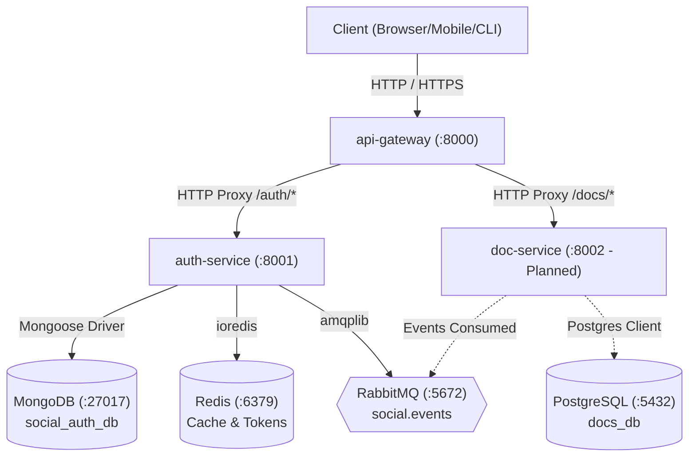

# 🗺️ Dependency Map

## Failure Dependency Analysis
- **If MongoDB fails**: `auth-service` cannot authenticate or register users. Returns HTTP 500 error safely.
- **If Redis fails**: `auth-service` gracefully degrades and falls back directly to MongoDB without crashing.
- **If RabbitMQ fails**: `auth-service` logs a warning and retries asynchronous event publishing without blocking synchronous HTTP responses.
