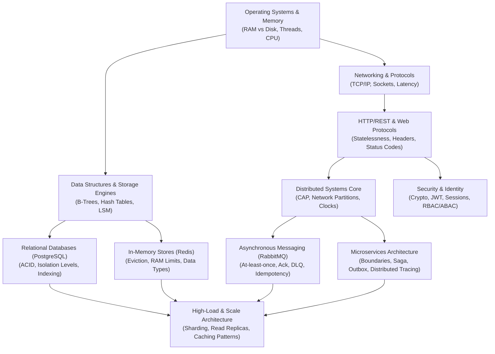

# 🧭 Learning Dependency Graph & Prerequisite Engine

Engineering knowledge is hierarchical and graph-based. When teaching complex topics, the mentor MUST verify whether lower-level prerequisites are mastered before explaining higher-level abstractions.

---

## 🗺️ Visual Prerequisite Graph

---

## 📋 Topic-to-Prerequisite Matrix

| Advanced Topic | Mandatory Prerequisites (Must master first) | Hidden/Common Knowledge Gaps | Follow-up Next Steps (What to learn next) |
| :--- | :--- | :--- | :--- |
| **Redis / Caching** | RAM vs Disk latency, Hash tables, Cache-Aside pattern | Serialization cost, Cache Avalanche, Cache Stampede, Network round-trips | Distributed Locks (Redlock), Redis Cluster, Multi-region caching |
| **RabbitMQ / Event Bus** | Synchronous vs Asynchronous, TCP sockets, Publisher-Subscriber pattern | At-least-once delivery duplicates, Consumer ack mechanics, Message ordering | Transactional Outbox pattern, Dead Letter Queues, Saga Orchestration |
| **Microservices** | Modular Monoliths, Clean/Layered Architecture, REST/gRPC API design | Network failure modes, Distributed transactions, Data ownership boundaries | Service Mesh, CQRS/Event Sourcing, Distributed Tracing (OpenTelemetry) |
| **JWT & Authentication** | Symmetric vs Asymmetric encryption, Statelessness, HTTP headers, Cookies vs Storage | Token revocation/blacklisting, Secret rotation, XSS/CSRF attack vectors | OAuth2.0 / OpenID Connect, Refresh Token Rotation, Session anomaly detection |
| **Database Indexing & ACID** | B-Tree / Hash index data structures, Disk I/O, Query execution plan | Write penalty of indexes, Lock contention, Dirty/Non-repeatable reads | Read-Write replicas, Partitioning, Zero-downtime schema migrations |
| **Concurrency & Locks** | OS processes vs threads, Event Loop, Race conditions | Optimistic vs Pessimistic locking, Distributed lock pitfalls | Multi-version Concurrency Control (MVCC), Actor model, Distributed consensus |

---

## 🔍 Pre-Flight Diagnostic Protocol (Knowledge Gap Detection)

Whenever the user asks to learn or implement an advanced system topic:

1. **Step 1: Check Prerequisites**: Query the table above for the target topic.
2. **Step 2: Probe with 1 Diagnostic Question**: If the learner appears uncertain or jumps straight into advanced tools, ask a short foundational probe (e.g. *"Before we configure RabbitMQ, how does your service currently handle it when an HTTP call to another service fails?"*).
3. **Step 3: Bridge the Foundation First**: If a fundamental gap is detected, explain the underlying physical/system problem first before configuring the tool.
4. **Step 4: Bridge to Next Level**: Conclude with a clear pointer to what learning milestone comes next.
