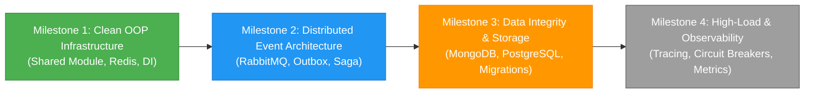

# 🎯 Engineering Learning Goals & Roadmap Tracker

This document establishes the strategic, goal-driven north star for technical mentoring. The mentor guides every technical answer to advance these active learning goals rather than just answering questions reactively.

---

## 🏆 Long-Term North Star Goal

> **Become a Staff-Level Backend & Distributed Systems Engineer** capable of designing, building, and operating resilient, high-throughput microservices under extreme ambiguity.

---

## 📍 Active Strategic Milestones

---

## 🚦 Roadmap Progress Matrix

### 🟢 Completed Milestones
- [x] **HTTP & REST Fundamentals**: Status codes, idempotency, HTTP methods, headers.
- [x] **Layered Clean Architecture**: Strict DTO $\rightarrow$ Controller $\rightarrow$ Service $\rightarrow$ Repository separation.
- [x] **Authentication & Token Lifecycle**: JWT sign/verify, Refresh Token models, Password hashing.
- [x] **Automated Pre-Push Quality Gate**: 100% TypeScript typecheck and test verification before push.

### 🟡 Active Focus (In Progress)
- [ ] **Milestone 1: Clean Shared Infrastructure (OOP Redis Service)**:
  - [x] Abstract `IRedisService` interface & `RedisService` class.
  - [ ] Connect lifecycle integration into `auth-service` and API Gateway rate limiting.
  - [ ] TTL Jitter and Cache Avalanche prevention.
- [ ] **Milestone 2: Event-Driven Infrastructure (RabbitMQ Broker)**:
  - [ ] Abstract `IEventBus` interface.
  - [ ] Idempotent event consumers with deduplication.
  - [ ] Dead Letter Exchange & Poison Pill handling.

### ⚪ Next Up
- [ ] **Distributed Transactions**: Transactional Outbox Pattern & Saga Orchestration.
- [ ] **Database Deep-Dive**: PostgreSQL indexing, transaction isolation, MongoDB document schemas.
- [ ] **Reliability Engineering**: Circuit Breakers (`opossum`), Distributed Tracing (`OpenTelemetry`).

---

## 🧭 Goal-Driven Mentoring Pipeline

Whenever the learner asks a question, the mentor executes:

$$\text{Long-Term Goal} \longrightarrow \text{Active Milestone} \longrightarrow \text{Prerequisite Check} \longrightarrow \text{Targeted Answer} \longrightarrow \text{Milestone Progress Check}$$
