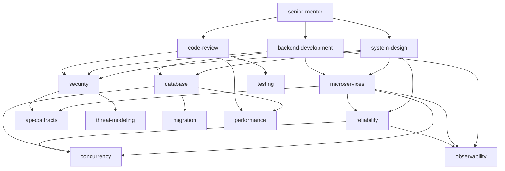

# 🕸️ Skill Dependency & Synergy Map

This map defines explicit dependency relationships, cross-domain synergies, and propagation rules between all engineering skills in the system.

---

## 🗺️ Skill Dependency Graph

---

## 📋 Explicit Skill Dependencies & Supporting Sets

| Primary Skill | Direct Dependencies (Requires) | Synergistic Supporting Skills | Typical Engineering Scenarios |
| :--- | :--- | :--- | :--- |
| **`backend-development`** | `database`, `security` | `microservices`, `observability`, `api-contracts` | Implementing REST/gRPC endpoints, service features, DTO/Repository logic |
| **`system-design`** | `reliability`, `security` | `microservices`, `database`, `performance` | High-level system architecture, scaling decisions, cross-service boundary design |
| **`microservices`** | `observability`, `reliability` | `api-contracts`, `concurrency`, `devops` | Inter-service messaging, event-driven pipelines, saga orchestration, resilience |
| **`security`** | `threat-modeling` | `api-contracts`, `system-design`, `database` | Authentication, RBAC/ABAC authorization, token lifecycle, vulnerability mitigation |
| **`database`** | `concurrency` | `migration`, `performance`, `reliability` | Schema design, indexing, transaction isolation, replication & sharding |
| **`code-review`** | `testing`, `security` | `performance`, `backend-development` | Pull request review, security audit, architecture fitness checks |
| **`reliability`** | `observability` | `concurrency`, `devops`, `system-design` | Circuit breakers, retry with backoff, fault tolerance, graceful degradation |
| **`concurrency`** | `database` | `reliability`, `performance` | Distributed locks, race condition prevention, optimistic/pessimistic locking |
| **`performance`** | `observability` | `database`, `concurrency` | Profiling, caching strategies, query optimization, memory leak resolution |
| **`api-contracts`** | `security` | `backend-development`, `testing` | DTO validation schemas, backward compatibility, breaking change prevention |
| **`migration`** | `database` | `reliability`, `devops` | Zero-downtime migrations, expand-contract pattern, large-table schema changes |
| **`devops`** | `observability` | `reliability`, `security` | Dockerfile, containerization, multi-stage builds, health checks |
| **`testing`** | `backend-development` | `code-review`, `reliability` | Unit, integration, E2E test suites, edge case & failure mode verification |
| **`threat-modeling`** | `security` | `system-design`, `api-contracts` | STRIDE analysis, attack surface assessment, trust boundary definition |
| **`observability`** | `reliability` | `devops`, `performance` | Structured logging, OpenTelemetry tracing, Prometheus metrics, alerting |
| **`senior-mentor`** | *Target Domain Skill* | `system-design`, `code-review` | Socratic teaching, conceptual explanations, architectural coaching |

---

## ⚡ Expansion & Context Loading Rules

1. **Primary Skill Selection**: Selected directly by the task intent and domain.
2. **Dependency Resolution**: When a Primary Skill is loaded, inspect its **Direct Dependencies**. If the task complexity is `Medium` or higher, load relevant direct dependencies as **Supporting Skills**.
3. **Context Budget Enforcement**: Never load more than **3 supporting skills** concurrently to respect the hard budget limit ($\le 6$ total markdown files).
